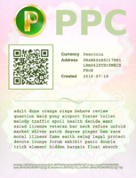

# Passport wallet

## Motivation

The benefit of paper wallets is that they are technically un-hackable
since the keys never exist online to be hacked in the first
place. However, there is another problem: the wallets must be stored
securely in the REAL world. Anyone who obtains a copy can access your
account. It's risky even to print paper wallets because many printers
keep copies of historic print jobs in local storage.

## Features

The `render-page.py` script generates a secure paper wallet for *any* crypto-currency.

* No need to hide your paper wallets! The Passport paper wallet is AES encrypted.
* Key stretching makes brute force attempts at cracking impractical.
* Data is represened as a sequence of English words making it easy to enter without errors.

## Sample usage

You must provide at minimum the currency symbol, a public address, and
a private key:

For help on the different options, run: `render-page.py -h`

Use `recover-key.py` to recover the private key. Just enter the word sequence and your password:

## Notes

The output of `render-page.py` is a single PNG file with design elements similar to a page in a passport. The color scheme is automatically derived from the colors in the currency logo. *Any* crypto-currency address can be represented since the encryption step is generic. The ideal use case for the Passport wallet is: secure cold-storage for a portfolio of crypto-currencies where the wallets themselves can be viewed by others without compromising security.

